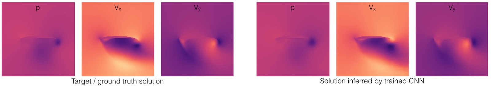
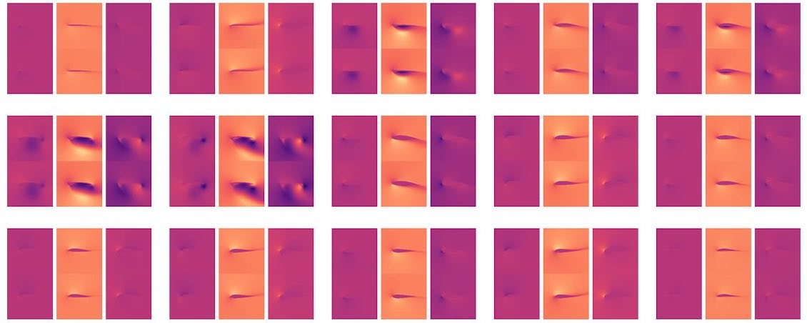

# Deep-Flow-Prediction 

_Deep Flow Prediction_ is a framework for fluid flow 
(Reynolds-averaged Navier Stokes) predictions with deep learning.
It contains code for data generation, network training, and evaluation.
Linux is highly recommended, and assumed as OS the following.

The accompanying paper can soon be found here:
<https://arxiv.org>

Contributing authors:
*N. Thuerey, K. Weissenow, H. Mehrotra, N. Mainali, L. Prantl, Xiangyu Hu*

You can also check out our TUM lab website with additional physics-based deep learning works at
<https://ge.in.tum.de/research/>.



# A quick how-to

All scripts below assume they're executed from their respective directories.

## Required software

This codebase requires _PyTorch_ and _numpy_ for the deep learning part,
and _openfoam_ and _gmsh_ for data generation and meshing (you don't need the latter 
two if you download the pre-computed training data below). 
To install these under linux run, use e.g.: 
```
sudo pip install torch numpy
sudo apt-get install openfoam5 gmsh
```
(Details can be found on the installation pages of [PyTorch](https://pytorch.org/get-started/locally/) and 
[OpenFOAM](https://openfoam.org/download/5-0-ubuntu/).)

## Data generation

Note that you can skip the next two steps if you download the training
data packages below. Simply make sure you have `data/train` and `data/test`
in the source directory, then you can continue with the training step.

### Download airfoils

First, enter the `data` directory. 
Download the airfoil profiles by running `./download_airfoils.sh`, this
will create `airfoil_database` and `airfoil_database_test` directories.
(The latter contains a subset that shouldn't be used for training.) The
airfoild database should contain 1498 files afterwards.

### Generate data

Now run `python ./dataGen.py` to generate a first set of 100 airfoils.
This script executes _openfoam_ and runs _gmsh_ for meshing the airfoil profiles. 

Once `dataGen.py` has finished, you should find 100 .npz files in a new
directory called `train`. You can call this script repeatedly to generate 
more data, or adjust
the `samples` variables to generate more samples with a single call. 
For a first test, 100 samples are sufficient, for higher quality models, more
than 10k are recommended..

Output files are saved as compressed numpy arrays. The tensor size in each
sample file is 6x128x128 with dimensions: channels, x, y. 
The first three channels represent the input,
consisting (in this order) of two fields corresponding to the freestream velocities in x and y
direction and one field containing a mask of the airfoil geometry as 
a mask. The last three channels represent the target, containing one pressure and two velocity
fields.

## Convolutional neural network training

Switch to the directory containing the training scripts, i.e., `../train/`,
and execute `python ./runTrain.py`. By default, this will execute a short training  run
with 10k iterations, loading all data that is available in `../data/train`. The L1 
validation loss is printed during training, and should decrease significantly.
Once the script has finished, it will save the trained model as `modelG`.

A sample image will be generated for each epoch in the `results_train` directory.
Optionally, you can also save txt files with the loss progression (see `saveL1` in the script).
explain created files:

## Test evaluation

To compute relative inference errors for a test data set, you can use the `./runTest.py` script.
By default, it assumes that the test data samples (with the same file format as the training samples)
are located in `../data/test`. Hence, you either have to generate data in a new directory with the
`dataGen.py` script from above, or download the test data set via the link below.

Once the test data is in place, execute `python ./runTest.py`. This script can compute accuracy 
evaluations for a range of models, it will automatically evaluate the test samples for all existing model files
named `modelG`,
`modelGa`,
`modelGb`,
`modelGc`, etc.

The text output will also be written to a file `testout.txt`. In addition, visualized reference data
and corresponding inferred outputs are written to `results_test` as PNGs.

## Further steps

For further experiments, you can increase the `expo` parameter in `runTrain.py` and `runTest.py` (note, non-integers are allowed). For large models you'll need much more data, though, to avoid overfitting.

In addition, the `DfpNet.py` file is worth a look: it contains most of the non-standard code for the RANS flow prediction. E.g., here you can find the U-net setup and data normalization. Hence, this class is a good starting point for experimenting with different architectures.

Note that both the `runTrain.py` and  `runTest.py` scripts also accept a prefix as command line argument. 
This can come in handy for automated runs with varying parameters.

# Data sets

Below you can download a large-scale training data set, and the test data set
used in the accompanying paper, as well as pre-trained models:

* a reduced data set with 6.4k samples plus test data: <http://ge.in.tum.de/download/data_6k.tar.gz>
* ... more will be made available here soon


<https://ge.in.tum.de/research/>


# Summary

Based on this framework, you should be able to train deep learning models that yield relative errors of 2-3%
for the RANS data sets. In addition, the network architecture should be applicable to other types of dense
PDE solutions.

Let us know if things don't work, or if you find ways to make it work even better :) !
The authors

[Thuerey Group](https://ge.in.tum.de/) , 
[Hu Group](https://www.aer.mw.tum.de/abteilungen/komplexe-fluide/) , 
[TUM](https://www.tum.de)


